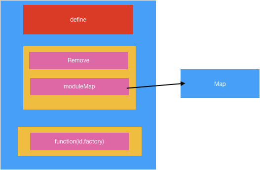
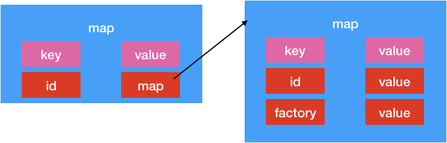

# cordova.js 文件分析

为啥上来先分析这个类呢?其实是因为我们创建的index.html文件中只对该文件做了引用,因此猜测,该文件应该是cordova的入口文件了.

# 文件解析


### 第一步: 整体语法

```js
;(function() {

})()
```

这个是js自执行语法 .大神解释———给自执行的代码块的中的变量保护,防止变量污染.


###  第一步:声明变量

```js
var PLATFORM_VERSION_BUILD_LABEL = '5.0.1';
var require;
var define;

```

这里声明三个变量

### 第二步:自执行程序

```js
(function () {

​    var modules = {};

​    // Stack of moduleIds currently being built.*

​    var requireStack = [];

​    // Map of module ID -> index into requireStack of modules currently being built.*

​    var inProgressModules = {};

​    var SEPARATOR = '.';


​    function build (module) {

​        var factory = module.factory;

​        var localRequire = function (id) {

​            var resultantId = id;

​            // Its a relative path, so lop off the last portion and add the id (minus "./")*

​            if (id.charAt(0) === '.') {

​                resultantId = module.id.slice(0, module.id.lastIndexOf(SEPARATOR)) + SEPARATOR + id.slice(2);

​            }

​            return require(resultantId);

​        };

​        module.exports = {};

​        delete module.factory;

​        factory(localRequire, module.exports, module);

​        return module.exports;

​    }


​    require = function (id) {

​        if (!modules[id]) {

​            throw 'module ' + id + ' not found';

​        } else if (id in inProgressModules) {

​            var cycle = requireStack.slice(inProgressModules[id]).join('->') + '->' + id;

​            throw 'Cycle in require graph: ' + cycle;

​        }

​        if (modules[id].factory) {

​            try {

​                inProgressModules[id] = requireStack.length;

​                requireStack.push(id);

​                return build(modules[id]);

​            } finally {

​                delete inProgressModules[id];

​                requireStack.pop();

​            }

​        }

​        return modules[id].exports;

​    };


​    define = function (id, factory) {

​        if (modules[id]) {

​            throw 'module ' + id + ' already defined';

​        }


​        modules[id] = {

​            id: id,

​            factory: factory

​        };

​    };


​    define.remove = function (id) {

​        delete modules[id];

​    };


​    define.moduleMap = modules;

})();


```

这也是自执行程序.为了防止该执行程序内的变量泄露给外界.

#####  自执行程序分析

1. 声明变量 modules,requireStack,inProgressModules,SEPARATOR
2. 声明函数 build (module) 
3. 给外界的require变量赋值.  (这里需要注意的是,该变量指向的是一个函数)
4. 给外界的define变量赋值(同理,该变量指向的是一个函数)
5. 给变量define 增加属性remove.该属性指向一个函数
6. 给变量define 增加属性moduleMap ,该属性指向变量modules

##### define变量分析

该变量结构体



从这个结构体的api能看出来,define相当于字典.

define自身指向的函数相当于向字典中添加数据

define的remove属性指向的函数相当于从字典中删除数据


从这里我们也能看出modules中的数据结构是 



##### require变量分析

该变量指向一个函数,该函数传入一个参数 id.


1. 如果从modules中查询id .没有直接抛出异常
2. 如果modules中存入id数据,那么我们检查id 是否存在inProgressModules变量(该变量也是map)中,存在该变量中,也抛出异常.(这里的requireStack和inProgressModules 目前看不出来有啥作用,因为我们没有向这里添加过如何数据)
3. 


