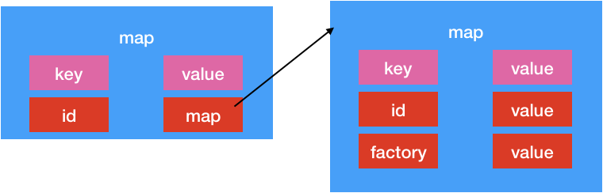

# cordova.js 文件分析(1)

为啥上来先分析这个类呢?其实是因为我们创建的index.html文件中只对该文件做了引用,因此猜测,该文件应该是cordova的入口文件了.

# 文件解析


### 第一步: 整体语法

```js
;(function() {

})()
```

这个是js自执行语法 .大神解释———给自执行的代码块的中的变量保护,防止变量污染.


###  第一步:声明变量

```js
var PLATFORM_VERSION_BUILD_LABEL = '5.0.1';
var require;
var define;

```

这里声明三个变量

### 第二步:自执行程序

```js
(function () {

​    var modules = {};

​    // Stack of moduleIds currently being built.*

​    var requireStack = [];

​    // Map of module ID -> index into requireStack of modules currently being built.*

​    var inProgressModules = {};

​    var SEPARATOR = '.';


​    function build (module) {

​        var factory = module.factory;

​        var localRequire = function (id) {

​            var resultantId = id;

​            // Its a relative path, so lop off the last portion and add the id (minus "./")*

​            if (id.charAt(0) === '.') {

​                resultantId = module.id.slice(0, module.id.lastIndexOf(SEPARATOR)) + SEPARATOR + id.slice(2);

​            }

​            return require(resultantId);

​        };

​        module.exports = {};

​        delete module.factory;

​        factory(localRequire, module.exports, module);

​        return module.exports;

​    }


​    require = function (id) {

​        if (!modules[id]) {

​            throw 'module ' + id + ' not found';

​        } else if (id in inProgressModules) {

​            var cycle = requireStack.slice(inProgressModules[id]).join('->') + '->' + id;

​            throw 'Cycle in require graph: ' + cycle;

​        }

​        if (modules[id].factory) {

​            try {

​                inProgressModules[id] = requireStack.length;

​                requireStack.push(id);

​                return build(modules[id]);

​            } finally {

​                delete inProgressModules[id];

​                requireStack.pop();

​            }

​        }

​        return modules[id].exports;

​    };


​    define = function (id, factory) {

​        if (modules[id]) {

​            throw 'module ' + id + ' already defined';

​        }


​        modules[id] = {

​            id: id,

​            factory: factory

​        };

​    };


​    define.remove = function (id) {

​        delete modules[id];

​    };


​    define.moduleMap = modules;

})();


```

这也是自执行程序.为了防止该执行程序内的变量泄露给外界.

#####  自执行程序分析

1. 声明变量 modules,requireStack,inProgressModules,SEPARATOR
2. 声明函数 build (module) 
3. 给外界的require变量赋值.  (这里需要注意的是,该变量指向的是一个函数)
4. 给外界的define变量赋值(同理,该变量指向的是一个函数)
5. 给变量define 增加属性remove.该属性指向一个函数
6. 给变量define 增加属性moduleMap ,该属性指向变量modules

##### define变量分析

该变量结构体


从这个结构体的api能看出来,define相当于字典.

define自身指向的函数相当于向字典中添加数据

define的remove属性指向的函数相当于从字典中删除数据

> define中的moduleMap相当于全局变量


```js
 modules[id] = {
            id: id,
            factory: factory
        };
```

从这里我们也能看出modules中的数据结构是 



##### require变量分析

该变量指向一个函数,该函数传入一个参数 id.

> throw 相当于返回
>
> slice() 方法可从已有的数组中返回选定的元素。
>
> ### 语法
>
> start 必需。规定从何处开始选取。如果是负数，那么它规定从数组尾部开始算起的位置。也就是说，-1 指最后一个元素，-2 指倒数第二个元素，以此类推。
>
> end 可选。规定从何处结束选取。该参数是数组片断结束处的数组下标。如果没有指定该参数，那么切分的数组包含从 start 到数组结束的所有元素。如果这个参数是负数，那么它规定的是从数组尾部开始算起的元素。
>
> join() 方法用于把数组中的所有元素放入一个字符串。
>
> 语法
>
> arrayObject.join(separator)
>
> separator 可选。指定要使用的分隔符。如果省略该参数，则使用逗号作为分隔符。


1. 正常检查modules 是否包含id 不包含直接抛出异常
2. 要是modules 中包含id的数值,那么检查是否加载过该id值.加载过就抛出异常(inProgressModules 是map,requireStack是list. inProgressModules 中key 对应的值就是存入在requireStack的下标)
3. 判断modules 中id 对应的字典是不是包含factory字段,包含.执行4,否则执行6
4. 将该id 保存在inProgressModules 和requireStack 中(防止多次加载), 调用build函数
5. 要是调用build函数出现异常,那么说明加载的数据是错误的,将数据从加载数据中清除掉
6. 返回modules[id].对应的exports字段(这里的exports字段是在build中加入的)

inProgressModules 和 requireStack 就是判断是否成功调用了build函数.防止多次调用.

> 这里的的modules 就是define 中moduleMap 指向数据。


>这里我们要理解require的作用：
>
>我们知道我们通过define加入到全局变量define指向的moduleMap中的factory是没有进行调用过的，只是一个指针。
>
>这里require 左右就是调用factory函数指针，将moduleMap[key]指向exports


##### build 函数

这里我们知道build函数传入的是map .结构{id:id,factory:factory}

1. 获取factory字段
2. 生成localRequire 函数指针
3. 给module 增加exports属性.exports 是map
4. 删除掉module的factory字段
5. 调用factory 函数
6. 返回module 的exports属性(是个字典)


> 这里的factory的数据结构能看出来了.
>
> 第一个参数是一个函数指针,
>
> 第二个参数是一个map
>
> 第三个参数是module


从上面的操作,我们知道了.modules 经过build的数据结构如下


> localRequire 函数
>
> 这里有个循环，require ->build > factory->localRequire->require 类似递归
>
> 这里这样写的目的是：我们可能会定义很多factory，而每个factory可能会依赖其他的factory，因此，我们在factory 中传入localRequire 就是让当前factory初始化以前保证依赖的factory已经进行了初始化


### node 赋值

```js
// Export for use in node*

if (typeof module === 'object' && typeof require === 'function') {

​    module.exports.require = require;

​    module.exports.define = define;

}
```


### define 的moduleMap加入数据

下面就向define的moduleMap中加入数据

 moduleMap 中的数据有key值有

+ cordova
+ cordova/argscheck
+ cordova/base64
+ cordova/builder
+ cordova/channel
+ cordova/exec
+ cordova/exec/proxy
+ cordova/init
+ cordova/modulemapper
+ cordova/platform
+ cordova/plugin/ios/console
+ cordova/plugin/ios/logger
+ cordova/pluginloader
+ cordova/urlutil
+ cordova/utils

> 这里我们知道我们是通过define的形式将 以上key加入到全局modules中的,因此这些key 对应的factory都没有进行初始化.只是暴露给外界一个引用.这样其实是有好处的.因为有的factory可能加载时很耗费时间的,这样写可以在需要加载factory模块的时候在加载.而不需要都加载所有模块.


接下来我们具体分析每个模块


