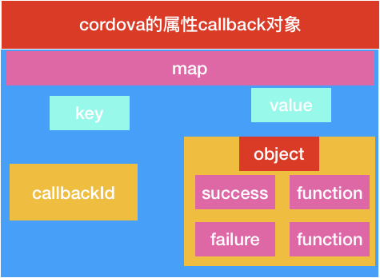

# cordova.js 文件分析(2)


###  ### 加载cordova 的factory模块

```js
window.cordova = require('cordova');
```

我们知道require 返回的一定是一个map  .这里是给window添加一个属性cordova属性,是map类型的.

由于factory比较长,因此这里分段分析

```js
if (window.cordova && !(window.cordova instanceof HTMLElement)) { *// eslint-disable-line no-undef*

​    throw new Error('cordova already defined');

}
```

这里就是判断window是否加载了cordova属性,防止重复加载

```js
var channel = require('cordova/channel');

var platform = require('cordova/platform');
```

需要依赖的模块

```js
var m_document_addEventListener = document.addEventListener;
var m_document_removeEventListener = document.removeEventListener;
var m_window_addEventListener = window.addEventListener;
var m_window_removeEventListener = window.removeEventListener;
```

声明四个变量指针,指向document 和window的监听事件

> document.addEventListener 
>
>  addEventListener里最后一个参数决定该事件的响应顺序；
>
> ​				如果为true事件执行顺序为 addEventListener—> 标签的onclick事件—> document.onclick　
>
> ​                如果为false事件的顺序为 标签的onclick事件—>document.onclick ------> addEventListener
>
> 　这里牵扯到“事件流”的概念。侦听器在侦听时有三个阶段：捕获阶段、目标阶段和冒泡阶段。顺序 为：捕获阶段（根节点到子节点检查是否调用了监听函数）→目标阶段（目标本身）→冒泡阶段（目标本身到根节点）。此处的参数确定侦听器是运行于捕获阶段、 目标阶段还是冒泡阶段。 如果将 useCapture 设置为 true，则侦听器只在捕获阶段处理事件，而不在目标或冒泡阶段处理事件。 如果useCapture 为 false，则侦听器只在目标或冒泡阶段处理事件。 要在所有三个阶段都侦听事件，请调用两次 addEventListener，一次将 useCapture 设置为 true，第二次再将useCapture 设置为 false。
>
> document.removeEventListener 同上 
>
> window.addEventListener 同上
>
> window.removeEventListener 同上
>
> **这里需要知道window 是在最顶层,而 docment是window之下**
>
> 捕获: window 先于document
>
> 冒泡:document 先于 window
>
> true 代表捕获阶段
>
> false 代表冒泡阶段
>
> 默认是false
>
> 这里可以理解可以拦截所有的事件


这里我们有必要了解下window和docment的区别

> **Window -- 代表浏览器中一个打开的窗口：**
>
> **对象属性**
> 　　window //窗口自身
> 　　window.self //引用本窗户window=window.self
> 　　window.name //为窗口命名
> 　　window.defaultStatus //设定窗户状态栏信息
> 　　window.location //URL地址，配备布置这个属性可以打开新的页面
>
> **对象方法**
> 　　window.alert("text") //提示信息会话框
> 　　window.confirm("text") //确认会话框
> 　　window.prompt("text") //要求键盘输入会话框
> 　　window.setIntervel("action",time) //每一隔指定的时间(毫秒)就执行一次操作
> 　　window.clearInterval() //清除时间配备布置作用就是终止轮回
> 　　window.setTimeout(action,time) //隔了指定的时间(毫秒)执行一次操作
> 　　window.open() //打开新的窗口
> 　　window.close() //关闭窗口
>
> **成员对象**
> 　　window.event
> 　　window.document //见document对象详解
> 　　window.history
> 　　window.screen
> 　　window.navigator
> 　　window.external
>
> ------
>
> 　　window.history对象
> 　　window.history.length //浏览过的页面数
> 　　history.back() //后退
> 　　history.forward() //前进
> 　　history.go(i) //前进或后退到历史记录的第i个页面
> 　　//i>0进步,i<0 后退
>
> ------
>
> 　　window.screen对象
>     　window.screen.width //屏幕宽度
> 　　window.screen.height //屏幕高度
> 　　window.screen.colorDepth //屏幕色深
> 　　window.screen.availWidth //可用宽度
> 　　window.screen.availHeight //可用高度(除去任务栏的高度)
>
> ------
>
> 　　window.external对象
> 　　window.external.AddFavorite("地址","标题" ) //把网站新增到保藏夹
>
> ------
>
> 　　window.navigator对象
> 　　window.navigator.appCodeName //浏览器代码名
> 　　window.navigator.appName //浏览器应用程序名
> 　　window.navigator.appMinorVersion //浏览器补丁版本
> 　　window.navigator.cpuClass //cpu类型 x86
> 　　window.navigator.platform //操作体系类型 win32
> 　　window.navigator.plugins
> 　　window.navigator.opsProfile
> 　　window.navigator.userProfile
> 　　window.navigator.systemLanguage //客户体系语言 zh-cn简体中文
> 　　window.navigator.userLanguage //用户语言,同上
> 　　window.navigator.appVersion //浏览器版本
> 　　window.navigator.userAgent
> 　　window.navigator.onLine //用户否在线
> 　　window.navigator.cookieEnabled //浏览器是否撑持cookie
> 　　window.navigator.mimeTypes

> **document对象 -- 代表整个HTML 文档,可用来访问页面中的所有元素：**
>
> **对象属性**
>
> > document.title                 //设置文档标题等价于HTML的
> > document.bgColor               //设置页面背景色
> > document.fgColor               //设置前景色(文本颜色)
> > document.linkColor             //未点击过的链接颜色
> > document.alinkColor            //激活链接(焦点在此链接上)的颜色
> > document.vlinkColor            //已点击过的链接颜色
> > document.URL                   //设置URL属性从而在同一窗口打开另一网页
> > document.fileCreatedDate       //文件建立日期，只读属性
> > document.fileModifiedDate      //文件修改日期，只读属性
> > document.fileSize              //文件大小，只读属性
> > document.cookie                //设置和读出cookie
> > document.charset               //设置字符集 简体中文:gb2312
>
> ## 常用对象方法
>
> > document.write()                      //动态向页面写入内容
> > document.createElement_x(Tag)           //创建一个html标签对象
> > document.getElementByIdx_x(ID)           //获得指定ID值的对象
> > document.getElementsByName(Name)      //获得指定Name值的对象
> > document.body.appendChild(oTag)
>
> ## body-主体子对象
>
> > document.body                   //指定文档主体的开始和结束等价于
> > document.body.bgColor           //设置或获取对象后面的背景颜色
> > document.body.link              //未点击过的链接颜色
> > document.body.alink             //激活链接(焦点在此链接上)的颜色
> > document.body.vlink             //已点击过的链接颜色
> > document.body.text              //文本色
> > document.body.innerText         //设置...之间的文本
> > document.body.innerHTML         //设置...之间的HTML代码
> > document.body.topMargin         //页面上边距
> > document.body.leftMargin        //页面左边距
> > document.body.rightMargin       //页面右边距
> > document.body.bottomMargin      //页面下边距
> > document.body.background        //背景图片
> > document.body.appendChild(oTag) //动态生成一个HTML对象
>
> ## 常用对象事件
>
> > document.body.onclick="func()"              //鼠标指针单击对象是触发
> > document.body.onmouseover="func()"          //鼠标指针移到对象时触发
> > document.body.onmouseout="func()"           //鼠标指针移出对象时触发
>
> ## location-位置子对象
>
> > document.location.hash          // #号后的部分
> > document.location.host          // 域名+端口号
> > document.location.hostname      // 域名
> > document.location.href          // 完整URL
> > document.location.pathname      // 目录部分
> > document.location.port          // 端口号
> > document.location.protocol      // 网络协议(http:)
> > document.location.search        // ?号后的部分
>
> ## 常用对象事件
>
> documeny.location.reload()          //刷新网页
> document.location.reload(URL)       //打开新的网页
> document.location.assign(URL)       //打开新的网页
>
> # document.location.replace(URL)      //打开新的网页
>
> selection-选区子对象
>
> # document.selection
>
> images集合(页面中的图象):
> \----------------------------
> a)通过集合引用
> document.images                 //对应页面上的标签
> document.images.length          //对应页面上标签的个数
> document.images[0]              //第1个标签          
> document.images[i]              //第i-1个标签
> \----------------------------
> b)通过nane属性直接引用
>
> document.images.oImage          //document.images.name属性
> \----------------------------
> c)引用图片的src属性
> document.images.oImage.src      //document.images.name属性.src


```js
var documentEventHandlers = {};
var windowEventHandlers = {};
```

声明两个事件处理变量

```js
document.addEventListener = function (evt, handler, capture) {
    var e = evt.toLowerCase();
    if (typeof documentEventHandlers[e] !== 'undefined') {
        documentEventHandlers[e].subscribe(handler);
    } else {
        m_document_addEventListener.call(document, evt, handler, capture);
    }
};
```

给document增加具体监听行为

1. 将事件变成小写的赋值给变量e
2. 判断变量documentEventHandlers 是否存入了e,存入,那么订阅handle
3. 没有存入e,那么,m_document_addEventListener 进行call函数

> **subscribe** 订阅
>
> 这是一种观察者模式,和publish(发布对应使用)  其实就是观察者模式了.
>
> call 方法
>
> | 语法                       | 定义                                               | 说明                                                         |
> | -------------------------- | -------------------------------------------------- | ------------------------------------------------------------ |
> | call(thisObj，Object)      | 调用一个对象的一个方法，以另一个对象替换当前对象。 | call 方法可以用来代替另一个对象调用一个方法。call 方法可将一个函数的对象上下文从初始的上下文改变为由 thisObj 指定的新对象.如果没有提供 thisObj 参数，那么 Global 对象被用作 thisObj |
> | apply(thisObj，[argArray]) | 应用某一对象的一个方法，用另一个对象替换当前对象。 | 如果 argArray 不是一个有效的数组或者不是 arguments 对象，那么将导致一个 TypeError。如果没有提供 argArray 和 thisObj 任何一个参数，那么 Global 对象将被用作 thisObj， 并且无法被传递任何参数 |


这个函数说明要是在documentEventHandlers 没有需要拦截的事件,那么我们就执行该事件.依次传递下去

> 该函数是给documentEventHandlers中添加的数据增加订阅事件的功能.


```js
window.addEventListener = function (evt, handler, capture) {
    var e = evt.toLowerCase();
    if (typeof windowEventHandlers[e] !== 'undefined') {
        windowEventHandlers[e].subscribe(handler);
    } else {
        m_window_addEventListener.call(window, evt, handler, capture);
    }
};

```

同理window增加事件

```js
document.removeEventListener = **function** (evt, handler, capture) {

​    **var** e = evt.toLowerCase();

​    *// If unsubscribing from an event that is handled by a plugin*

​    **if** (**typeof** documentEventHandlers[e] !== 'undefined') {

​        documentEventHandlers[e].unsubscribe(handler);

​    } **else** {

​        m_document_removeEventListener.call(document, evt, handler, capture);

​    }

};


window.removeEventListener = **function** (evt, handler, capture) {

​    **var** e = evt.toLowerCase();

​    *// If unsubscribing from an event that is handled by a plugin*

​    **if** (**typeof** windowEventHandlers[e] !== 'undefined') {

​        windowEventHandlers[e].unsubscribe(handler);

​    } **else** {

​        m_window_removeEventListener.call(window, evt, handler, capture);

​    }

};
```

这里和增加事件是相对的.

```js
function createEvent (type, data) {
    var event = document.createEvent('Events');
    event.initEvent(type, false, false);
    if (data) {
        for (var i in data) {
            if (data.hasOwnProperty(i)) {
                event[i] = data[i];
            }
        }
    }
    return event;
}

```

创建event ,并且该event 设置上所有传入的data属性

这里大概是自定义事件

> **对于标准浏览器**，其提供了可供元素触发的方法：`element.dispatchEvent()`. 不过，在使用该方法之前，我们还需要做其他两件事，及创建和初始化。因此，总结说来就是：
>
> ```js
> document.createEvent()
> event.initEvent()
> element.dispatchEvent()
> ```
>
> 举个板栗：
>
> ```js
> $(dom).addEvent("alert", function() {
>     alert("弹弹弹，弹走鱼尾纹~~");
> });
> 
> // 创建
> var evt = document.createEvent("HTMLEvents");
> // 初始化
> evt.initEvent("alert", false, false);
> 
> // 触发, 即弹出文字
> dom.dispatchEvent(evt);
> ```


接下来就是定义cordova对象并赋值给module.exports = cordova;

```js
var cordova = {
  
};
module.exports = cordova;
```


##### cordova 结构

```js
  define: define,
   require: require,
    version: PLATFORM_VERSION_BUILD_LABEL,
    platformVersion: PLATFORM_VERSION_BUILD_LABEL,
    platformId: platform.id,
```

这几个就是简单赋值

```js
   addWindowEventHandler: function (event) {
        return (windowEventHandlers[event] = channel.create(event));
    },
    addStickyDocumentEventHandler: function (event) {
        return (documentEventHandlers[event] = channel.createSticky(event));
    },
    addDocumentEventHandler: function (event) {
        return (documentEventHandlers[event] = channel.create(event));
    },
    removeWindowEventHandler: function (event) {
        delete windowEventHandlers[event];
    },
    removeDocumentEventHandler: function (event) {
        delete documentEventHandlers[event];
    },
```


这里我们知道上文的windowEventHandlers 对象 和 documentEventHandlers 对象是添加数据是通过这几个api添加的.这几个api添加事件拦截.算是切面技术吧

> 从这里我们应该能看出来,这里添加的事件都是需要拦截的事件.


```js
  getOriginalHandlers: function () {
        return { 'document': { 'addEventListener': m_document_addEventListener, 'removeEventListener': m_document_removeEventListener },
            'window': { 'addEventListener': m_window_addEventListener, 'removeEventListener': m_window_removeEventListener } };
    },
```

这里就是返回一个对象,包含window 和document 对象的监听和移出对象api.


```js
   fireDocumentEvent: function (type, data, bNoDetach) {
        var evt = createEvent(type, data);
        if (typeof documentEventHandlers[type] !== 'undefined') {
            if (bNoDetach) {
                documentEventHandlers[type].fire(evt);
            } else {
                setTimeout(function () {
                    // Fire deviceready on listeners that were registered before cordova.js was loaded.
                    if (type === 'deviceready') {
                        document.dispatchEvent(evt);
                    }
                    documentEventHandlers[type].fire(evt);
                }, 0);
            }
        } else {
            document.dispatchEvent(evt);
        }
    },
    fireWindowEvent: function (type, data) {
        var evt = createEvent(type, data);
        if (typeof windowEventHandlers[type] !== 'undefined') {
            setTimeout(function () {
                windowEventHandlers[type].fire(evt);
            }, 0);
        } else {
            window.dispatchEvent(evt);
        }
    },
```


这两个函数分别是针对window 和document 两个对象的.因此拿出一个来看就可以了

这里以document 为例

1. 创建event对象
2. 判断documentEventHandlers 要是没有注册该事件,那么久直接调用该事件
3. 要是documentEventHandlers 中注册了该事件,那么就fire 下该事件.
4. 要是type 是deviceready 那么,就直接执行该事件(这里需要注意,这是我们注册过的事件,这里应该就会直接执行我们定义的回调函数 )
5. 

> 疑问
>
> 这里fire 干嘛用的暂时不知道.(答案需要看完channel对象才知道)


> setTimeout(0)的作用
>
> ```js
> function a() {
> setTimeout( function(){
> alert(1)
> }, 0);
> alert(2);
> }
> a();
> ```
>
> 代码中的 `setTimeout` 设为 0，也就是延迟 0ms，看上去是不做任何延迟立刻执行，即依次弹出 “1”、“2”。但实际的执行结果确是 “2”、“1”。其中的原因得从 `setTimeout` 的原理说起：
>
> JavaScript 是单线程执行的，也就是无法同时执行多段代码，当某一段代码正在执行的时候，所有后续的任务都必须等待，形成一个队列，一旦当前任务执行完毕，再从队列中取出下一个任务。这也常被称为 “阻塞式执行”。所以一次鼠标点击，或是计时器到达时间点，或是 Ajax 请求完成触发了回调函数，这些事件处理程序或回调函数都不会立即运行，而是立即排队，一旦线程有空闲就执行。假如当前 JavaScript 进程正在执行一段很耗时的代码，此时发生了一次鼠标点击，那么事件处理程序就被阻塞，用户也无法立即看到反馈，事件处理程序会被放入任务队列，直到前面的代码结束以后才会开始执行。如果代码中设定了一个 `setTimeout`，那么浏览器便会在合适的时间，将代码插入任务队列，如果这个时间设为 0，就代表立即插入队列，但不是立即执行，仍然要等待前面代码执行完毕。所以`setTimeout` 并不能保证执行的时间，是否及时执行取决于 JavaScript 线程是拥挤还是空闲。
>
> 
>
> settimeout(0)就起到了一个将事件加入到队列中，待执行的一个功能效果！


```js
 callbackId: Math.floor(Math.random() * 2000000000),
    callbacks: {},
    callbackStatus: {
        NO_RESULT: 0,
        OK: 1,
        CLASS_NOT_FOUND_EXCEPTION: 2,
        ILLEGAL_ACCESS_EXCEPTION: 3,
        INSTANTIATION_EXCEPTION: 4,
        MALFORMED_URL_EXCEPTION: 5,
        IO_EXCEPTION: 6,
        INVALID_ACTION: 7,
        JSON_EXCEPTION: 8,
        ERROR: 9
    },

```


callbackId :cordova 对象的id ,我们这里能看出来,这个id很大,一般情况下是不可能出现重复的

callbackStatus: 返回对象的状态


```js
  callbackSuccess: function (callbackId, args) {
        cordova.callbackFromNative(callbackId, true, args.status, [args.message], args.keepCallback);
    },
```

成功回调


```js
   callbackError: function (callbackId, args) {
        // TODO: Deprecate callbackSuccess and callbackError in favour of callbackFromNative.
        // Derive success from status.
        cordova.callbackFromNative(callbackId, false, args.status, [args.message], args.keepCallback);
    },
```

失败回调


```js
 callbackFromNative: function (callbackId, isSuccess, status, args, keepCallback) {
        try {
            var callback = cordova.callbacks[callbackId];
            if (callback) {
                if (isSuccess && status === cordova.callbackStatus.OK) {
                    callback.success && callback.success.apply(null, args);
                } else if (!isSuccess) {
                    callback.fail && callback.fail.apply(null, args);
                }
                /*
                else
                    Note, this case is intentionally not caught.
                    this can happen if isSuccess is true, but callbackStatus is NO_RESULT
                    which is used to remove a callback from the list without calling the callbacks
                    typically keepCallback is false in this case
                */
                // Clear callback if not expecting any more results
                if (!keepCallback) {
                    delete cordova.callbacks[callbackId];
                }
            }
        } catch (err) {
            var msg = 'Error in ' + (isSuccess ? 'Success' : 'Error') + ' callbackId: ' + callbackId + ' : ' + err;
            console && console.log && console.log(msg);
            console && console.log && err.stack && console.log(err.stack);
            cordova.fireWindowEvent('cordovacallbackerror', { 'message': msg });
            throw err;
        }
    },
```


该函数分析执行逻辑分析

1. 获取callbackId对应的callBack函数
2. 要是没有callback,那么就调用window的cordovacallbackerror事件
3. 要是有callback事件,那么调用callback事件
4. 不需要callback事件,就删除该事件

从这里我们大概能猜出callback事件的结构




```js
 addConstructor: function (func) {
        channel.onCordovaReady.subscribe(function () {
            try {
                func();
            } catch (e) {
                console.log('Failed to run constructor: ' + e);
            }
        });
    }
    
```

这里操作的是channel对象.这里暂时不详解.下节详细介绍

```
module.exports = cordova; 
```

这里给module的exports 赋值

>这里其实就是将全局变量modules 中的cordova 相当于给实例化了.(factory变成了exports)


