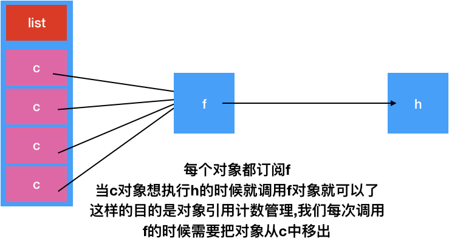

# cordova.js 文件分析(3)


### cordova/channel 从factory转变成exports

我们从cordova 的factory 中转变到exports的过程中,我们知道需要加载cordova/channel,因此我们需要知道该类在cordova加载过程中是很重要的


该类基本结构如下

```js
var channel = {

};
module.exports = channel;
```

这里主要要看channel对象


```js
var utils = require('cordova/utils');
var nextGuid = 1;
```

加载工具类和定义变量


```js
var Channel = function (type, sticky) {
    this.type = type;
    // Map of guid -> function.
    this.handlers = {};
    // 0 = Non-sticky, 1 = Sticky non-fired, 2 = Sticky fired.
    this.state = sticky ? 1 : 0;
    // Used in sticky mode to remember args passed to fire().
    this.fireArgs = null;
    // Used by onHasSubscribersChange to know if there are any listeners.
    this.numHandlers = 0;
    // Function that is called when the first listener is subscribed, or when
    // the last listener is unsubscribed.
    this.onHasSubscribersChange = null;
};
```

定义一个对象


```js
var channel = {
  
}
```

下面就是我们需要exports的结构体channel,我们分段实现channel

```js
 join: function (h, c) {
        var len = c.length;
        var i = len;
        var f = function () {
            if (!(--i)) h();
        };
        for (var j = 0; j < len; j++) {
            if (c[j].state === 0) {
                throw Error('Can only use join with sticky channels.');
            }
            c[j].subscribe(f);
        }
        if (!len) h();
    },
```


> 第一个属性join 指向的是一个函数,有两个参数,根据实现,我们知道 h是一个函数 .类型是function(){},c是一个list
>
> 函数解释:1.要是传入的c是nil ,那么就直接执行函数h
>
> ​				 2 要还是传入的c中含有多个数据,那么需要将c中的每个数据进行订阅f.
>
> 这里其实是绑定一个函数和多个对象之间的关系.

结构如下




```js
 create: function (type) {
        return channel[type] = new Channel(type, false);
    },
    createSticky: function (type) {
        return channel[type] = new Channel(type, true);
    },
```

这里是给channel对象动态添加属性,但是每个属性都是Channel对象


```js
deviceReadyChannelsArray: [],
deviceReadyChannelsMap: {},
 
```

声明两个变量


```js
 waitForInitialization: function (feature) {
        if (feature) {
            var c = channel[feature] || this.createSticky(feature);
            this.deviceReadyChannelsMap[feature] = c;
            this.deviceReadyChannelsArray.push(c);
        }
    },
```

生成feature属性对象,存放在deviceReadyChannelsArray 和 deviceReadyChannelsMap 中.保存的Channel对象的stick是1

```js
 initializationComplete: function (feature) {
        var c = this.deviceReadyChannelsMap[feature];
        if (c) {
            c.fire();
        }
    }
```

读取feature对象,并fire


> 从以上我们能看出来,其实channel相对还是相对的api不多,不过这里需要注意的的,channel具有动态增加属性的能力.因此我们需要看看channel到底增加了那些属性.


```js
function checkSubscriptionArgument (argument) {
    if (typeof argument !== 'function' && typeof argument.handleEvent !== 'function') {
        throw new Error(
            'Must provide a function or an EventListener object ' +
                'implementing the handleEvent interface.'
        );
    }
}
```

该函数来校验subscription参数的正确性的

```js
Channel.prototype.subscribe = function (eventListenerOrFunction, eventListener) {
    checkSubscriptionArgument(eventListenerOrFunction);
    var handleEvent, guid;

    if (eventListenerOrFunction && typeof eventListenerOrFunction === 'object') {
        // Received an EventListener object implementing the handleEvent interface
        handleEvent = eventListenerOrFunction.handleEvent;
        eventListener = eventListenerOrFunction;
    } else {
        // Received a function to handle event
        handleEvent = eventListenerOrFunction;
    }

    if (this.state === 2) {
        handleEvent.apply(eventListener || this, this.fireArgs);
        return;
    }

    guid = eventListenerOrFunction.observer_guid;
    if (typeof eventListener === 'object') {
        handleEvent = utils.close(eventListener, handleEvent);
    }

    if (!guid) {
        // First time any channel has seen this subscriber
        guid = '' + nextGuid++;
    }
    handleEvent.observer_guid = guid;
    eventListenerOrFunction.observer_guid = guid;

    // Don't add the same handler more than once.
    if (!this.handlers[guid]) {
        this.handlers[guid] = handleEvent;
        this.numHandlers++;
        if (this.numHandlers === 1) {
            this.onHasSubscribersChange && this.onHasSubscribersChange();
        }
    }
};

```

1. 检查参数
2. 声明变量
3. 根据eventListenerOrFunction 类型给相关变量赋值
4. 要是state == 2 那么调用handleEvent函数并返回
5. 给变量guid 赋值
6. 用对象utils 对handleEvent 处理
7. 要是没有设置guid ,那么生成一个
8. 给handleEvent赋值. (guid相当于标记)
9. eventListenerOrFunction赋值
10. 将guid 存入到handle中,要是第一次加入需要调用onHasSubscribersChange


```js
Channel.prototype.unsubscribe = function (eventListenerOrFunction) {
    checkSubscriptionArgument(eventListenerOrFunction);
    var handleEvent, guid, handler;

    if (eventListenerOrFunction && typeof eventListenerOrFunction === 'object') {
        // Received an EventListener object implementing the handleEvent interface
        handleEvent = eventListenerOrFunction.handleEvent;
    } else {
        // Received a function to handle event
        handleEvent = eventListenerOrFunction;
    }

    guid = handleEvent.observer_guid;
    handler = this.handlers[guid];
    if (handler) {
        delete this.handlers[guid];
        this.numHandlers--;
        if (this.numHandlers === 0) {
            this.onHasSubscribersChange && this.onHasSubscribersChange();
        }
    }
};
```


订阅操作的逆向操作

```js
Channel.prototype.fire = function (e) {
    var fail = false; // eslint-disable-line no-unused-vars
    var fireArgs = Array.prototype.slice.call(arguments);
    // Apply stickiness.
    if (this.state === 1) {
        this.state = 2;
        this.fireArgs = fireArgs;
    }
    if (this.numHandlers) {
        // Copy the values first so that it is safe to modify it from within
        // callbacks.
        var toCall = [];
        for (var item in this.handlers) {
            toCall.push(this.handlers[item]);
        }
        for (var i = 0; i < toCall.length; ++i) {
            toCall[i].apply(this, fireArgs);
        }
        if (this.state === 2 && this.numHandlers) {
            this.numHandlers = 0;
            this.handlers = {};
            this.onHasSubscribersChange && this.onHasSubscribersChange();
        }
    }
};

```

这个函数我们在cordova中见过.但具体不知道什么用.这里需要仔细看了


1. 声明变量 fail;
2. 生成语法糖 fireArgs (fireArgs就是函数,fireArgs().
3. 如果state 状态是1 那么变成2 ,并且记录语法糖
4. 要是numhandles不是0执行5
5. 对handles 处理并调用函数
6. 要是state == 2 并且**this**.numHandlers 有数据,那么重置数据


估计好多人看到这里还是很懵逼的.不知道上面这三个函数到底是干啥用的.因此需要特别说明下.

这里大家看着混乱主要是因为里面多了好多状态的判断,我们 把代码简化

```

Channel.prototype.subscribe = function (eventListenerOrFunction, eventListener) {
    var handleEvent;
    handleEvent = eventListenerOrFunction;
    if (!this.handlers[guid]) {
        this.handlers[guid] = handleEvent;
        this.numHandlers++;
      }
};

Channel.prototype.unsubscribe = function (eventListenerOrFunction) {
    var handleEvent = eventListenerOrFunction
    guid = handleEvent.observer_guid;
    handler = this.handlers[guid];
    if (handler) {
        delete this.handlers[guid];
        this.numHandlers--;
    }
};

Channel.prototype.fire = function (e) {
    var fail = false; // eslint-disable-line no-unused-vars
    var fireArgs = Array.prototype.slice.call(arguments);
    if (this.numHandlers) {
        var toCall = [];
        for (var item in this.handlers) {
            toCall.push(this.handlers[item]);
        }
        for (var i = 0; i < toCall.length; ++i) {
            toCall[i].apply(this, fireArgs);
        }
         this.numHandlers = 0;
         this.handlers = {};
        
    }
};
```


>subscribe 相当于想handles添加数据
>
>unsubscribe 相当于从handles删除数据
>
>fire 相当于调用handles中的数据,并清空handles
>
>这里只不过想进行相关操作需要满足条件.具体添加什么样子的数据,后面需要往后看


```js
channel.createSticky('onDOMContentLoaded');

// Event to indicate the Cordova native side is ready.
channel.createSticky('onNativeReady');

// Event to indicate that all Cordova JavaScript objects have been created
// and it's time to run plugin constructors.
channel.createSticky('onCordovaReady');

// Event to indicate that all automatically loaded JS plugins are loaded and ready.
// FIXME remove this
channel.createSticky('onPluginsReady');

// Event to indicate that Cordova is ready
channel.createSticky('onDeviceReady');
```

动态增加四个属性

```js
channel.create('onResume');

*// Event to indicate a pause lifecycle event*

channel.create('onPause');
```

增加两个未知状态属性

```js
channel.waitForInitialization('onCordovaReady');

channel.waitForInitialization('onDOMContentLoaded');
```

增加两个特性属性


channel的结构如下

+ create->function
+ createSticky->function
+ deviceReadyChannelsArray->[] 包含onCordovaReady 和 onDOMContentLoaded
+ deviceReadyChannelsMap->{} 其中包含onCordovaReady 和 onDOMContentLoaded
+ waitForInitialization->function
+ initializationComplete->function
+ onDOMContentLoaded->Channel (stick=1)
+ onNativeReady->Channel (stick=1)
+ onCordovaReady->Channel (stick=1)
+ onPluginsReady->Channel (stick=1)
+ onDeviceReady->Channel (stick=1)
+ onResume->Channel (stick=0)
+ onPause->Channel (stick=0)
+ onCordovaReady->Channel (stick=1)
+ onDOMContentLoaded->Channel (stick=1)


### cordova/utils 从factory转变成exports

这里我们需要看看这个工具modules.这个是在cordova/channel中require的

其实这个类还是很简单的.从命名上看就是工具类.

```js
var utils = exports;

```

直接让utils指向exports .直接操作utils相当于直接操作exports

```js
utils.defineGetterSetter = function (obj, key, getFunc, opt_setFunc) {
    if (Object.defineProperty) {
        var desc = {
            get: getFunc,
            configurable: true
        };
        if (opt_setFunc) {
            desc.set = opt_setFunc;
        }
        Object.defineProperty(obj, key, desc);
    } else {
        obj.__defineGetter__(key, getFunc);
        if (opt_setFunc) {
            obj.__defineSetter__(key, opt_setFunc);
        }
    }
};

/**
 * Defines a property getter for obj[key].
 */
utils.defineGetter = utils.defineGetterSetter;

```

这里定义get和set 方法,浏览器的适配. 具体怎么用可以看[这里](https://www.cnblogs.com/bydzhangxiaowei/p/8089127.html)

```js
utils.arrayIndexOf = function (a, item) {
    if (a.indexOf) {
        return a.indexOf(item);
    }
    var len = a.length;
    for (var i = 0; i < len; ++i) {
        if (a[i] === item) {
            return i;
        }
    }
    return -1;
};
```

返回对象在数组的index

```js
utils.arrayRemove = function (a, item) {
    var index = utils.arrayIndexOf(a, item);
    if (index !== -1) {
        a.splice(index, 1);
    }
    return index !== -1;
};

```

数组删除对象 返回是否删除成功

```
utils.typeName = function (val) {
    return Object.prototype.toString.call(val).slice(8, -1);
};
```

返回属性名字


```js
utils.isArray = Array.isArray ||
                function (a) { return utils.typeName(a) === 'Array'; };
```

返回是否是数组


```js
utils.isDate = function (d) {
    return (d instanceof Date);
};

```

返回是否是日期对象

```js
utils.clone = function (obj) {
    if (!obj || typeof obj === 'function' || utils.isDate(obj) || typeof obj !== 'object') {
        return obj;
    }

    var retVal, i;

    if (utils.isArray(obj)) {
        retVal = [];
        for (i = 0; i < obj.length; ++i) {
            retVal.push(utils.clone(obj[i]));
        }
        return retVal;
    }

    retVal = {};
    for (i in obj) {
        // https://issues.apache.org/jira/browse/CB-11522 'unknown' type may be returned in
        // custom protocol activation case on Windows Phone 8.1 causing "No such interface supported" exception
        // on cloning.
        if ((!(i in retVal) || retVal[i] !== obj[i]) && typeof obj[i] !== 'undefined' && typeof obj[i] !== 'unknown') { // eslint-disable-line valid-typeof
            retVal[i] = utils.clone(obj[i]);
        }
    }
    return retVal;
};

```

对象深copy

```js
utils.close = function (context, func, params) {
    return function () {
        var args = params || arguments;
        return func.apply(context, args);
    };
};
```

该方法就是执行函数func


了解arguments这个对象之前先来认识一下javascript的一些功能：

其实Javascript并没有重载函数的功能，但是Arguments对象能够模拟重载。Javascrip中每个函数都会有一个Arguments对象实例arguments，它引用着函数的实参，可以用数组下标的方式"[]"引用arguments的元素。arguments.length为函数实参个数，arguments.callee引用函数自身。

arguments他的特性和使用方法

**特性：**

1.arguments对象和Function是分不开的。

2.因为arguments这个对象不能显式创建。

3.arguments对象只有函数开始时才可用。

**使用方法：**

虽然arguments对象并不是一个数组，但是访问单个参数的方式与访问数组元素的方式相同

例如：

arguments[0],arguments[1],。。。arguments[n]； 

在js中 不需要明确指出参数名，就能访问它们，


```js
function UUIDcreatePart (length) {
    var uuidpart = '';
    for (var i = 0; i < length; i++) {
        var uuidchar = parseInt((Math.random() * 256), 10).toString(16);
        if (uuidchar.length === 1) {
            uuidchar = '0' + uuidchar;
        }
        uuidpart += uuidchar;
    }
    return uuidpart;
}
utils.createUUID = function () {
    return UUIDcreatePart(4) + '-' +
        UUIDcreatePart(2) + '-' +
        UUIDcreatePart(2) + '-' +
        UUIDcreatePart(2) + '-' +
        UUIDcreatePart(6);
};


```

uuid


```js
utils.extend = (function () {
    // proxy used to establish prototype chain
    var F = function () {};
    // extend Child from Parent
    return function (Child, Parent) {

        F.prototype = Parent.prototype;
        Child.prototype = new F();
        Child.__super__ = Parent.prototype;
        Child.prototype.constructor = Child;
    };
}());
```

构建继承关系


```js
utils.alert = function (msg) {
    if (window.alert) {
        window.alert(msg);
    } else if (console && console.log) {
        console.log(msg);
    }
};

});

```

alert 弹框


### cordova/platform 从factory转变成exports

```js
// file: /Users/dpogue/Coding/cordova-ios/cordova-js-src/platform.js
define("cordova/platform", function(require, exports, module) {

module.exports = {
    id: 'ios',
    bootstrap: function () {
        // Attach the console polyfill that is iOS-only to window.console
        // see the file under plugin/ios/console.js
        require('cordova/modulemapper').clobbers('cordova/plugin/ios/console', 'window.console');

        require('cordova/channel').onNativeReady.fire();
    }
};

});

```


这部分还是很简单的.

id 代表平台

bootstrap: 平台初始化需要调用的函数 


