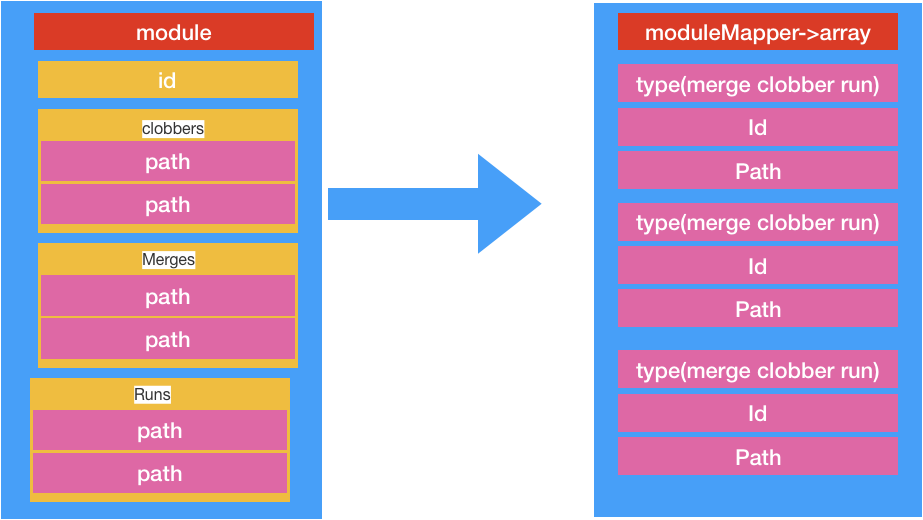

#cordova.js 文件分析(4)

### cordova/builder 从factory转变成exports

```js
var utils = require('cordova/utils');
```

引用工具模块

```js
function each (objects, func, context) {
    for (var prop in objects) {
        if (objects.hasOwnProperty(prop)) {
            func.apply(context, [objects[prop], prop]);
        }
    }
}
```

对象的所有属性都调用func函数 .函数的第一个参数是object ,第二个参数是key


```js
function clobber (obj, key, value) {
    exports.replaceHookForTesting(obj, key);
    var needsProperty = false;
    try {
        obj[key] = value;
    } catch (e) {
        needsProperty = true;
    }
    // Getters can only be overridden by getters.
    if (needsProperty || obj[key] !== value) {
        utils.defineGetter(obj, key, function () {
            return value;
        });
    }
}

```

给对象obj增加属性key,值是value


```js
function assignOrWrapInDeprecateGetter (obj, key, value, message) {
    if (message) {
        utils.defineGetter(obj, key, function () {
            console.log(message);
            delete obj[key];
            clobber(obj, key, value);
            return value;
        });
    } else {
        clobber(obj, key, value);
    }
}

```

是否打印message 也是增加属性


```js
function include (parent, objects, clobber, merge) {
    each(objects, function (obj, key) {
        try {
            var result = obj.path ? require(obj.path) : {};

            if (clobber) {
                // Clobber if it doesn't exist.
                if (typeof parent[key] === 'undefined') {
                    assignOrWrapInDeprecateGetter(parent, key, result, obj.deprecated);
                } else if (typeof obj.path !== 'undefined') {
                    // If merging, merge properties onto parent, otherwise, clobber.
                    if (merge) {
                        recursiveMerge(parent[key], result);
                    } else {
                        assignOrWrapInDeprecateGetter(parent, key, result, obj.deprecated);
                    }
                }
                result = parent[key];
            } else {
                // Overwrite if not currently defined.
                if (typeof parent[key] === 'undefined') {
                    assignOrWrapInDeprecateGetter(parent, key, result, obj.deprecated);
                } else {
                    // Set result to what already exists, so we can build children into it if they exist.
                    result = parent[key];
                }
            }

            if (obj.children) {
                include(result, obj.children, clobber, merge);
            }
        } catch (e) {
            utils.alert('Exception building Cordova JS globals: ' + e + ' for key "' + key + '"');
        }
    });
}

```


这里有递归操作

> 这里each函数解析对象所有的key 和value值
>
> 判断obj 对象要是有path属性,就require 下该路径.获取路径的result

参数

1. parent 在递归objects对象的时候,想当与全局变量
2. objects 有可能含有path 和 children两个属性
3. Cobbler 和merge 两个布尔变量,可以组合四种情况,不过 在cobbler是false的情况,merge没有意义,所以相当于三种情况


##### 第一种情况 clobber = false

1.obj对象如果有path ,那么require下path的数据.

2.如果parent[key].没有数据,那么就设置parent[key]=result

3.判断obj是否有children属性,有,那么result作为parent,obj.children作为obj 递归操作result对象.其实就是map中需要包含children的属性和值

如图


##### 第二种情况clobber = true merge=false

1. obj对象如果有path ,那么require下path的数据.
2. 如果parent[key].没有数据,那么就设置parent[key]=result
3. 如果parent[key]定义了,那么就需要检查obj的path属性是否为空.要是不为空,不为空就替换parent[key]的值为result
4. 判断obj是否有children属性,有,那么result作为parent,obj.children作为obj 递归操作result对象.其实就是map中需要包含children的属性和值


> 这里其实能看出来,这种情况下,要是obj有path,那么,我们需要替换parent[key]的值,即使parent[key]本身有值


###### 第三种情况clobber = true merge = true

与第二种情况就是是否需要全部替换parent[key]的值,在obj.path 有值的时候.这里调用了recursiveMerge 函数.(递归)


```js
function recursiveMerge (target, src) {
    for (var prop in src) {
        if (src.hasOwnProperty(prop)) {
            if (target.prototype && target.prototype.constructor === target) {
                // If the target object is a constructor override off prototype.
                clobber(target.prototype, prop, src[prop]);
            } else {
                if (typeof src[prop] === 'object' && typeof target[prop] === 'object') {
                    recursiveMerge(target[prop], src[prop]);
                } else {
                    clobber(target, prop, src[prop]);
                }
            }
        }
    }
}
```

这里就是对属相进行赋值操作,

要是target的父类是自己,那么就直接将src相关属性赋值给自己

要是target的父类是别的,该属性和父类属性都是 object对象类型的时候,进行递归曹操别的就给target赋值


```js
exports.buildIntoButDoNotClobber = function (objects, target) {
    include(target, objects, false, false);
};
exports.buildIntoAndClobber = function (objects, target) {
    include(target, objects, true, false);
};
exports.buildIntoAndMerge = function (objects, target) {
    include(target, objects, true, true);
};
```

三种引用的操作

```js
exports.recursiveMerge = recursiveMerge;
exports.assignOrWrapInDeprecateGetter = assignOrWrapInDeprecateGetter;
exports.replaceHookForTesting = function () {};
```

主要函数的引用


### cordova/modulemapper 从factory转变成exports

```js
var builder = require('cordova/builder');
```

请求builder

```js
var moduleMap = define.moduleMap;
```

这里获取了全局modules


```js
var symbolList;
var deprecationMap;
```


```js
exports.reset = function () {
    symbolList = [];
    deprecationMap = {};
};
```

重置reset 和deprecationMap变量

```js
function addEntry (strategy, moduleName, symbolPath, opt_deprecationMessage) {
    if (!(moduleName in moduleMap)) {
        throw new Error('Module ' + moduleName + ' does not exist.');
    }
    symbolList.push(strategy, moduleName, symbolPath);
    if (opt_deprecationMessage) {
        deprecationMap[symbolPath] = opt_deprecationMessage;
    }
}

```

这里就是给数组添加数据,每次添加三个,这样其实就是相当于一个二维数组吧.

```js
exports.clobbers = function (moduleName, symbolPath, opt_deprecationMessage) {
    addEntry('c', moduleName, symbolPath, opt_deprecationMessage);
};
exports.merges = function (moduleName, symbolPath, opt_deprecationMessage) {
    addEntry('m', moduleName, symbolPath, opt_deprecationMessage);
};

exports.defaults = function (moduleName, symbolPath, opt_deprecationMessage) {
    addEntry('d', moduleName, symbolPath, opt_deprecationMessage);
};
exports.runs = function (moduleName) {
    addEntry('r', moduleName, null);
};

```

对应build的三种模式

```js
function prepareNamespace (symbolPath, context) {
    if (!symbolPath) {
        return context;
    }
    var parts = symbolPath.split('.');
    var cur = context;
    for (var i = 0, part; part = parts[i]; ++i) { // eslint-disable-line no-cond-assign
        cur = cur[part] = cur[part] || {};
    }
    return cur;
}
```

这函数简单,可惜不知道数据啥样子,无法判断该函数用来干啥的

```js
exports.mapModules = function (context) {
    var origSymbols = {};
    context.CDV_origSymbols = origSymbols;
    for (var i = 0, len = symbolList.length; i < len; i += 3) {
        var strategy = symbolList[i];
        var moduleName = symbolList[i + 1];
        var module = require(moduleName);
        // <runs/>
        if (strategy === 'r') {
            continue;
        }
        var symbolPath = symbolList[i + 2];
        var lastDot = symbolPath.lastIndexOf('.');
        var namespace = symbolPath.substr(0, lastDot);
        var lastName = symbolPath.substr(lastDot + 1);

        var deprecationMsg = symbolPath in deprecationMap ? 'Access made to deprecated symbol: ' + symbolPath + '. ' + deprecationMsg : null;
        var parentObj = prepareNamespace(namespace, context);
        var target = parentObj[lastName];

        if (strategy === 'm' && target) {
            builder.recursiveMerge(target, module);
        } else if ((strategy === 'd' && !target) || (strategy !== 'd')) {
            if (!(symbolPath in origSymbols)) {
                origSymbols[symbolPath] = target;
            }
            builder.assignOrWrapInDeprecateGetter(parentObj, lastName, module, deprecationMsg);
        }
    }
};

```

1. 遍历symbolList数组
2. 获取strategy 和moduleName 数据, 
3. 调用require()函数获取exports数据
4. 如果 strategy 是r 代表run ,因此继续遍历其他的
5. 获取变量symbolPath 
6. 获取信号路径和执行名字
7. 获取target 对象(这里由于不知道context对象,因此获取到的target目前不知道啥啥样子的)
8. 要是有target ,并且需要merge,那么就讲module 更新到target中.
9. 其他情况下,要是origSymbols对象中没有symbolPath,那么就设置symbolPath,值是target
10. 把module设置进入parentObj中

> 这里逻辑简单,由于不知道具体对象的数据结构,因此需要后面回来再分析下这里的具体流程


```js
exports.getOriginalSymbol = function (context, symbolPath) {
    var origSymbols = context.CDV_origSymbols;
    if (origSymbols && (symbolPath in origSymbols)) {
        return origSymbols[symbolPath];
    }
    var parts = symbolPath.split('.');
    var obj = context;
    for (var i = 0; i < parts.length; ++i) {
        obj = obj && obj[parts[i]];
    }
    return obj;
};
```

获取原始信号


### cordova/pluginloader 从factory转变成exports


```js
exports.injectScript = function (url, onload, onerror) {
    var script = document.createElement('script');
    // onload fires even when script fails loads with an error.
    script.onload = onload;
    // onerror fires for malformed URLs.
    script.onerror = onerror;
    script.src = url;
    document.head.appendChild(script);
};

```

增加js注入代码

这里需要注意script的onload方法. 该方法触发时机是在加载完毕文件的时候就触发该函数

> onload事件在资源被加载完成后会被触发。对于script标签，在外部js文件被加载后代码会被立即执行。那么，外部js文件中的代码和该script标签的onload回调函数，它们的执行顺序是怎样的呢？没有找到官方的说明文档，所以自己做个实验。


```js
function injectIfNecessary (id, url, onload, onerror) {
    onerror = onerror || onload;
    if (id in define.moduleMap) { // eslint-disable-line no-undef
        onload();
    } else {
        exports.injectScript(url, function () {
            if (id in define.moduleMap) { // eslint-disable-line no-undef
                onload();
            } else {
                onerror();
            }
        }, onerror);
    }
}

```

如果id存在全局modules中,那么直接onload(相当于回调)

如果id不存在全局modules中,那么,我们先加载资源,加载完毕资源再检查是否在全局modules中,有就回调,没有就报错

> 这里外部加载的文件必须要cordova.define进行定义才行 要不加载报错.


```js
function onScriptLoadingComplete (moduleList, finishPluginLoading) {
    // Loop through all the plugins and then through their clobbers and merges.
    for (var i = 0, module; module = moduleList[i]; i++) { // eslint-disable-line no-cond-assign
        if (module.clobbers && module.clobbers.length) {
            for (var j = 0; j < module.clobbers.length; j++) {
                modulemapper.clobbers(module.id, module.clobbers[j]);
            }
        }

        if (module.merges && module.merges.length) {
            for (var k = 0; k < module.merges.length; k++) {
                modulemapper.merges(module.id, module.merges[k]);
            }
        }

        // Finally, if runs is truthy we want to simply require() the module.
        if (module.runs) {
            modulemapper.runs(module.id);
        }
    }

    finishPluginLoading();
}
```

 这里我们能看出来module 一定包含id属性,还可能有 clobbers ,merges 和 runs属性,将这些属性的值和id绑定.存放在 modulemapper的数组中.最后调用finishPluginLoading(回调) 函数



​    


```js

function handlePluginsObject (path, moduleList, finishPluginLoading) {
    // Now inject the scripts.
    var scriptCounter = moduleList.length;

    if (!scriptCounter) {
        finishPluginLoading();
        return;
    }
    function scriptLoadedCallback () {
        if (!--scriptCounter) {
            onScriptLoadingComplete(moduleList, finishPluginLoading);
        }
    }

    for (var i = 0; i < moduleList.length; i++) {
        injectIfNecessary(moduleList[i].id, path + moduleList[i].file, scriptLoadedCallback);
    }
}

```

处理插件

1. 检查插件数组数量,空调用回调函数返回
2. 声明回调函数,该函数在所有的modules都加载完毕后执行回调函数
3. 注入插件

```js
function findCordovaPath () {
    var path = null;
    var scripts = document.getElementsByTagName('script');
    var term = '/cordova.js';
    for (var n = scripts.length - 1; n > -1; n--) {
        var src = scripts[n].src.replace(/\?.*$/, ''); // Strip any query param (CB-6007).
        if (src.indexOf(term) === (src.length - term.length)) {
            path = src.substring(0, src.length - term.length) + '/';
            break;
        }
    }
    return path;
}
```

读取所有的scripts标签.从中查询cordova.js 文件

获取cordova路径 .并且将src 指向指向空


```js
exports.load = function (callback) {
    var pathPrefix = findCordovaPath();
    if (pathPrefix === null) {
        console.log('Could not find cordova.js script tag. Plugin loading may fail.');
        pathPrefix = '';
    }
    injectIfNecessary('cordova/plugin_list', pathPrefix + 'cordova_plugins.js', function () {
        var moduleList = require('cordova/plugin_list');
        handlePluginsObject(pathPrefix, moduleList, callback);
    }, callback);
};
```

1. 找cordova路径
2. 要是没有该路径.不能加载
3. 加载cordova_plugins.js 文件
4. 调用cordova/plugin_list module
5. 处理moduleList


> 从这里我们能看才出来,所有的路径应该都是依托cordova路径的.


