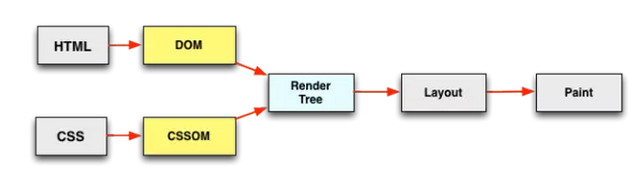
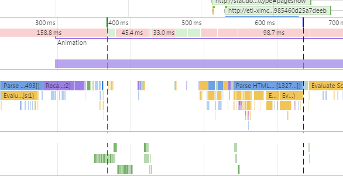
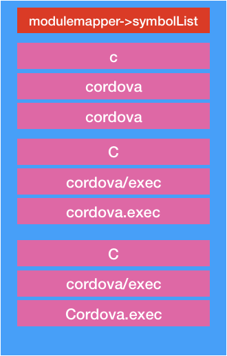

# cordova.js 文件分析(5)


### cordova/init module 分析

```js
var channel = require('cordova/channel');
var cordova = require('cordova');
var modulemapper = require('cordova/modulemapper');
var platform = require('cordova/platform');
var pluginloader = require('cordova/pluginloader');
var utils = require('cordova/utils');

```

这是**cordova/init**所需要依赖的module.为了看懂这个模块,我们先把上述modules全部给分析了


```js
var platformInitChannelsArray = [channel.onNativeReady, channel.onPluginsReady];

```

声明数组,保存channel的两个属性

```js
function logUnfiredChannels (arr) {
    for (var i = 0; i < arr.length; ++i) {
        if (arr[i].state !== 2) {
            console.log('Channel not fired: ' + arr[i].type);
        }
    }
}
```

日志的打印函数

```js
window.setTimeout(function () {
    if (channel.onDeviceReady.state !== 2) {
        console.log('deviceready has not fired after 5 seconds.');
        logUnfiredChannels(platformInitChannelsArray);
        logUnfiredChannels(channel.deviceReadyChannelsArray);
    }
}, 5000);
```

五秒后检查channel的onDeviceReady 状态

```js
function replaceNavigator (origNavigator) {
    var CordovaNavigator = function () {};
    CordovaNavigator.prototype = origNavigator;
    var newNavigator = new CordovaNavigator();
    // This work-around really only applies to new APIs that are newer than Function.bind.
    // Without it, APIs such as getGamepads() break.
    if (CordovaNavigator.bind) {
        for (var key in origNavigator) {
            if (typeof origNavigator[key] === 'function') {
                newNavigator[key] = origNavigator[key].bind(origNavigator);
            } else {
                (function (k) {
                    utils.defineGetterSetter(newNavigator, key, function () {
                        return origNavigator[k];
                    });
                })(key);
            }
        }
    }
    return newNavigator;
}
```

替换导航

```
if (window.navigator) {
    window.navigator = replaceNavigator(window.navigator);
}
```

要是window有导航,替换成我们自己需要的

```js
if (!window.console) {
    window.console = {
        log: function () {}
    };
}
if (!window.console.warn) {
    window.console.warn = function (msg) {
        this.log('warn: ' + msg);
    };
}
```

日志相关设置

```js
channel.onPause = cordova.addDocumentEventHandler('pause');
channel.onResume = cordova.addDocumentEventHandler('resume');
channel.onActivated = cordova.addDocumentEventHandler('activated');
channel.onDeviceReady = cordova.addStickyDocumentEventHandler('deviceready');
```

这里需要注意,我们对channel 的 onPause onResume onActivated onDeviceReady 重新生成Channel.

> onActivated 以前是没有的,在这个时候添加的

并且这四个事件的句柄在cordova对象的documentEventHandlers 有保存的

```
if (document.readyState === 'complete' || document.readyState === 'interactive') {
    channel.onDOMContentLoaded.fire();
} else {
    document.addEventListener('DOMContentLoaded', function () {
        channel.onDOMContentLoaded.fire();
    }, false);
}

```

这里我们需要知道document 有四种状态

1. uninitialized - 还未开始载入
2. loading - 载入中
3. interactive - 已加载，文档与用户可以开始交互
4. complete - 载入完成

当这个属性的值变化时，[`document`](https://developer.mozilla.org/zh-CN/docs/Web/API/Document) 对象上的`readystatechange` 事件将被触发。

这里还需要知道

> DOMContentLoaded顾名思义，就是dom内容加载完毕。那什么是dom内容加载完毕呢？我们从打开一个网页说起。当输入一个URL，页面的展示首先是空白的，然后过一会，页面会展示出内容，但是页面的有些资源比如说图片资源还无法看到，此时页面是可以正常的交互，过一段时间后，图片才完成显示在页面。从页面空白到展示出页面内容，会触发DOMContentLoaded事件。而这段时间就是HTML文档被加载和解析完成。
>
> 这时候问题又来了，什么是HTML文档被加载和解析完成。要解决这个问题，我们就必须了解浏览器渲染原理。
>
> 当我们在浏览器地址输入URL时，浏览器会发送请求到服务器，服务器将请求的HTML文档发送回浏览器，浏览器将文档下载下来后，便开始从上到下解析，解析完成之后，会生成DOM。如果页面中有css，会根据css的内容形成CSSOM，然后DOM和CSSOM会生成一个渲染树，最后浏览器会根据渲染树的内容计算出各个节点在页面中的确切大小和位置，并将其绘制在浏览器上。
>
> 
>
> 下面就是页面加载和解析过程中，浏览器的一个快照
>
> 
>
> 上面我们看到在解析html的过程中，html的解析会被中断，这是因为javascript会阻塞dom的解析。当解析过程中遇到<script>标签的时候，便会停止解析过程，转而去处理脚本，如果脚本是内联的，浏览器会先去执行这段内联的脚本，如果是外链的，那么先会去加载脚本，然后执行。在处理完脚本之后，浏览器便继续解析HTML文档。
>
> 同时javascript的执行会受到标签前面样式文件的影响。如果在标签前面有样式文件，需要样式文件加载并解析完毕后才执行脚本。这是因为javascript可以查询对象的样式。
>
> 这里需要注意一点，在现在浏览器中，为了减缓渲染被阻塞的情况，现代的浏览器都使用了猜测预加载。当解析被阻塞的时候，浏览器会有一个轻量级的HTML（或CSS）扫描器（scanner）继续在文档中扫描，查找那些将来可能能够用到的资源文件的url，在渲染器使用它们之前将其下载下来。
>
> 在这里我们可以明确DOMContentLoaded所计算的时间，当文档中没有脚本时，浏览器解析完文档便能触发 DOMContentLoaded 事件；如果文档中包含脚本，则脚本会阻塞文档的解析，而脚本需要等位于脚本前面的css加载完才能执行。在任何情况下，DOMContentLoaded 的触发不需要等待图片等其他资源加载完成。
>
> 接下来，我们来说说load，页面上所有的资源（图片，音频，视频等）被加载以后才会触发load事件，简单来说，页面的load事件会在DOMContentLoaded被触发之后才触发。

小知识

>  **最后我们来回答这个问题：我们为什么一再强调将css放在头部，将js文件放在尾部**
>
> 在面试的过程中，经常会有人在回答页面的优化中提到将js放到body标签底部，原因是因为浏览器生成Dom树的时候是一行一行读HTML代码的，script标签放在最后面就不会影响前面的页面的渲染。那么问题来了，既然Dom树完全生成好后页面才能渲染出来，浏览器又必须读完全部HTML才能生成完整的Dom树，script标签不放在body底部是不是也一样，因为dom树的生成需要整个文档解析完毕。
>
> 我们再来看一下chrome在页面渲染过程中的，绿色标志线是First Paint的时间。纳尼，为什么会出现firstpaint，页面的paint不是在渲染树生成之后吗？其实现代浏览器为了更好的用户体验,渲染引擎将尝试尽快在屏幕上显示的内容。它不会等到所有HTML解析之前开始构建和布局渲染树。部分的内容将被解析并显示。也就是说浏览器能够渲染不完整的dom树和cssom，尽快的减少白屏的时间。假如我们将js放在header，js将阻塞解析dom，dom的内容会影响到First Paint，导致First Paint延后。所以说我们会将js放在后面，以减少First Paint的时间，但是不会减少DOMContentLoaded被触发的时间。


从上面的知识,我们知道.当文档渲染或者加载完毕.我们需要channel的onDOMContentLoaded 属性执行fire方法.

```
if (window._nativeReady) {
    channel.onNativeReady.fire();
}

```

不知道干啥用,该window在哪添加的该属性

```js
modulemapper.clobbers('cordova', 'cordova');
modulemapper.clobbers('cordova/exec', 'cordova.exec');
modulemapper.clobbers('cordova/exec', 'Cordova.exec');
```

这里我们看出来了.我们向modulemapper 中添加数据的样本了

modulemapper->symbolList 结构体





```
platform.bootstrap && platform.bootstrap();
```

```
define("cordova/platform", function(require, exports, module) {

module.exports = {
    id: 'ios',
    bootstrap: function () {
        // Attach the console polyfill that is iOS-only to window.console
        // see the file under plugin/ios/console.js
        require('cordova/modulemapper').clobbers('cordova/plugin/ios/console', 'window.console');

        require('cordova/channel').onNativeReady.fire();
    }
};

});
```

上面看出来,我们在modulemapper->symbolList 又加入了新的数据,打印数据

并且这里更新了channel对象onNativeReady属性的状态


```js
setTimeout(function () {
    pluginloader.load(function () {
        channel.onPluginsReady.fire();
    });
}, 0);

```

相当于立即执行pluginloader的load方法.要是load方法执行完毕,就更新channel 属性onPluginsReady 状态.

这里是加载插件

这里如何解析插件的cordova/plugin_list.在后面章节分析

```js
channel.join(function () {
    modulemapper.mapModules(window);

    platform.initialize && platform.initialize();

    // Fire event to notify that all objects are created
    channel.onCordovaReady.fire();

    // Fire onDeviceReady event once page has fully loaded, all
    // constructors have run and cordova info has been received from native
    // side.
    channel.join(function () {
        require('cordova').fireDocumentEvent('deviceready');
    }, channel.deviceReadyChannelsArray);

}, platformInitChannelsArray);
```


1. platformInitChannelsArray 数组内容 **var** platformInitChannelsArray = [channel.onNativeReady, channel.onPluginsReady];

2. join方法

   ```js
    join: function (h, c) {
           var len = c.length;
           var i = len;
           var f = function () {
               if (!(--i)) h();
           };
           for (var j = 0; j < len; j++) {
               if (c[j].state === 0) {
                   throw Error('Can only use join with sticky channels.');
               }
               c[j].subscribe(f);
           }
           if (!len) h();
       },
   ```


> join方法,我们知道c =  [channel.onNativeReady, channel.onPluginsReady]
>
> 这里就好理解join方法了.只有当channel的onNativeReady,  和channel.onPluginsReady 都fire之后,才能调用函数f

分析函数f

1. 调用 modulemapper.mapModules(window);
2. 平台需要如果需要初始化就调用初始化函数
3. 跟新channel状态
4. 当channel的onCordovaReady 和 onDOMContentLoaded 都加载完毕,执行5
5.   require('cordova').fireDocumentEvent('deviceready');

> 这里第一步,上面的章节由于没有具体的context.因此没有具体分析mapModules 这里具体分析
>
> ```js
> exports.mapModules = function (context) {
>     var origSymbols = {};
>     context.CDV_origSymbols = origSymbols;
>     for (var i = 0, len = symbolList.length; i < len; i += 3) {
>         var strategy = symbolList[i];
>         var moduleName = symbolList[i + 1];
>         var module = require(moduleName);
>         // <runs/>
>         if (strategy === 'r') {
>             continue;
>         }
>         var symbolPath = symbolList[i + 2];
>         var lastDot = symbolPath.lastIndexOf('.');
>         var namespace = symbolPath.substr(0, lastDot);
>         var lastName = symbolPath.substr(lastDot + 1);
> 
>         var deprecationMsg = symbolPath in deprecationMap ? 'Access made to deprecated symbol: ' + symbolPath + '. ' + deprecationMsg : null;
>         var parentObj = prepareNamespace(namespace, context);
>         var target = parentObj[lastName];
> 
>         if (strategy === 'm' && target) {
>             builder.recursiveMerge(target, module);
>         } else if ((strategy === 'd' && !target) || (strategy !== 'd')) {
>             if (!(symbolPath in origSymbols)) {
>                 origSymbols[symbolPath] = target;
>             }
>             builder.assignOrWrapInDeprecateGetter(parentObj, lastName, module, deprecationMsg);
>         }
>     }
> };
> 
> ```
>
> context 是window
>
> 这里symbolList 中的数据有是["c", "cordova", "cordova", "c","cordova/exec", "cordova.exec", "c","cordova/exec", "Cordova.exec","c", "cordova/plugin/ios/console", "window.console"]
>
> 1. 给window的CDV_origSymbols 赋值对象{}
>
> 2. 遍历symbolList 数组,三个数据一组处理
>
> 3. 获取类型和module的名字
>
> 4. 这里require module (相当于将module中没有转换成exports的进行转换成exports,cordova/exec和cordova/plugin/ios/console 需要加载) 
>
> 5. 对cordova , cordova.exec,"Cordova.exec ,"window.console 进行处理赋值给相关变量
>
> 6. 调用prepareNamespace 就是判断是否window 是否有属性namespace(symbolPath以点分割的第一部分,这里)
>
> 7. 这里就是动态添加属性到相关变量下,根是window.
>
>    假设symbolPath=cordova ,那么我就需要把require的module 赋值到window的属性cordova下面
>
>    假设symbolPath=cordova.exec ,那么我们就需要把require的module值赋值给window->cordova->exec下面
>
>    假设symbolPath=Cordova.exec,由于window没有属性,因此这个就给抛弃了
>
>    假设symbolPath=window.console  我们就更新window->console的属性


到此为止cordova分析完毕


