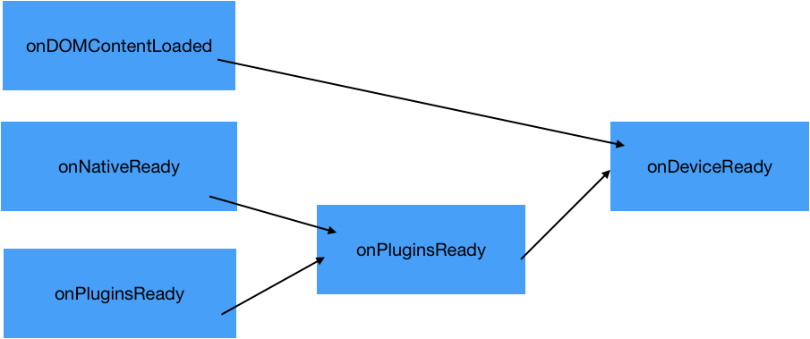
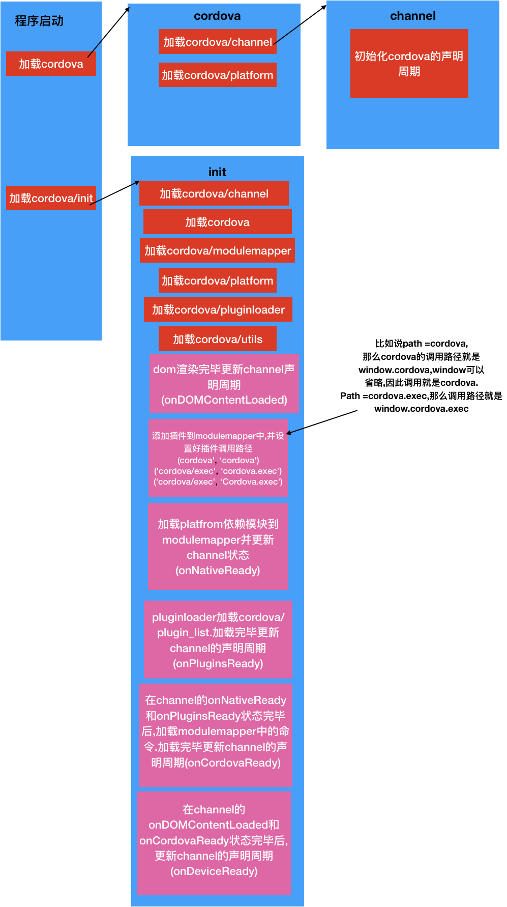

# cordova.js总结

### cordova声明周期

cordova 一共有一下声明周期

1. onDOMContentLoaded
2. onNativeReady
3. onCordovaReady
4. onPluginsReady
5. onDeviceReady


> onDOMContentLoaded  当dom加载完毕之后调用 (当document调用DOMContentLoaded或者ocument.readyState是complete或者interactive时候调用.)
>
> onNativeReady 代表native依赖module加载完毕
>
> onPluginsReady 代表我们依赖的插件加载完毕
>
> onCordovaReady 当deviceready 和onPluginsReady 状态都加载完毕,执行该函数
>
> onDeviceReady  当onDOMContentLoaded 和onCordovaReady 都加载完毕执行该函数

声明周期如下图





### cordova 加载流程





> modulemapper 装的是加载命令
>
> pluginloader 加载的是插件路径在cordova/plugin_list  
>
> 弄懂上面这两个module 开起来就很快了. 


```

```

cordova.define('cordova/plugin_list', **function**(require, exports, module) {

module.exports =[{
    "id": "cordova-plugin-camera.Camera",
    "file": "plugins/cordova-plugin-camera/www/CameraConstants.js",
    "pluginId": "cordova-plugin-camera",
    "clobbers": [
      "Camera"
    ] 

}];

 module.exports.metadata = {

​    "cordova-plugin-camera": "4.0.2",

​    "cordova-plugin-whitelist": "1.3.3"

  };

},


